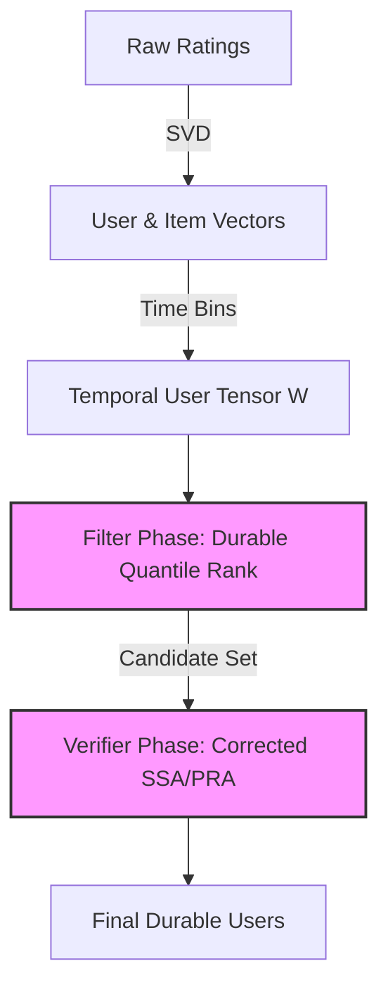
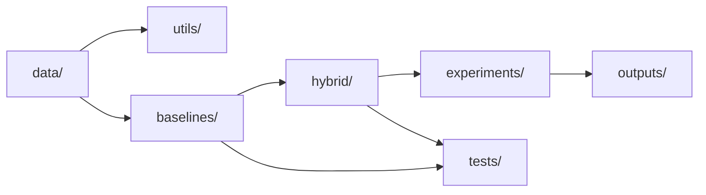
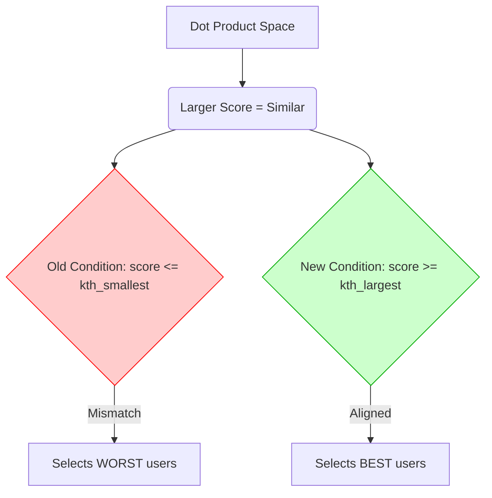

# Chapter 1 — Executive summary

## Overview
This project solves the problem of finding **durable reverse top-$k$ recommendations** efficiently. In traditional forward recommendation, we ask: "Which $k$ items should we recommend to this user?" In a **reverse** query, we ask the opposite: "Which users would have this query item in their top-$k$ recommendations?" This is crucial for targeted marketing and inventory promotion.

**Durability** adds a temporal dimension. User preferences change over time. A user is considered a "durable" match if the query item remains in their top-$k$ recommendations for a required fraction of continuous time windows.

Finding exact matches requires processing the entire user-item matrix over time, which is extremely expensive. To reduce this work, the project uses a **hybrid filter-verifier pipeline**. First, a fast approximate filter identifies a small pool of likely candidate users. Then, an exact verifier checks only these candidates. This drastically reduces the computational burden.

The project implemented baseline algorithms (SSA and PRA) and hybrid filters based on existing literature. However, a significant problem was discovered: the original implementation used contradictory score conventions. The baselines expected smaller scores to mean better recommendations, but the dataset embeddings (via dot products) meant larger scores were better. This accidentally caused the original filters to select the *worst* users. 

This semantic error was corrected. The implementation now consistently treats a **larger dot product as a stronger preference**. The corrected work features a robust durability-aware quantile filter (`durable_quantile_rank_filter`), deterministic PRA, and an exact testing suite.

The corrected MovieLens and Netflix results show that the new filter successfully identifies candidates with high precision and pruning. In MovieLens, it achieves perfect recall. In Netflix, recall is weaker, highlighting the difficulty of approximate temporal filtering on sparse data. The current contribution is a fully corrected, verified, and modular temporal retrieval framework. Work remains to improve recall on larger, sparser datasets like Netflix.


*Figure 1: Pipeline diagram showing the flow from raw data to verified durable users.*

---

# Chapter 2 — Background concepts from zero

## Recommendation systems
A recommendation system suggests **items** (like movies) to **users**. A user's **preference** is historically recorded as a **rating** (e.g., 5 stars). The system tries to predict missing ratings to make **top-$k$ recommendations**—the $k$ items a user will like the most.

## Rating matrix
The data is a table where **rows** are users, **columns** are items, and **matrix entries** are ratings. Because most users only rate a few items, most entries are missing. This is called a **sparse matrix**.
*Example:*
| User | Item 1 | Item 2 | Item 3 |
|---|---|---|---|
| User A | 5 | ? | 4 |
| User B | ? | 1 | ? |

## Latent vectors
Instead of keeping the huge sparse matrix, we learn **latent features** (hidden patterns). Every user and item is represented as a small vector (a list of numbers) of size $d$. This is the **embedding dimension**. Vectors are useful because they compress information; similar users have vectors that point in similar directions.

## SVD (Singular Value Decomposition)
SVD is the math used to create these vectors. It approximates the rating matrix $R$:
$$ R \approx U \Sigma V^T $$
- $U$: User factors
- $\Sigma$: Singular values (weights of the features)
- $V^T$: Item factors
In **truncated SVD**, we only keep the top $d$ features. The $\sqrt{\Sigma}$ is mathematically divided between $U$ and $V^T$ so that both user and item embeddings share the feature weights equally.

## Dot product
To predict how much a user likes an item, we multiply their vectors together using a **dot product**:
$$ score(u,i) = u \cdot i $$
In the corrected project, vectors are matched such that a **larger score = stronger predicted preference**. Because the project uses L2 normalization (scaling vectors to length 1), the dot product is equivalent to cosine similarity.

## Rank
A user's top item has rank 1, their second has rank 2, etc. A smaller numerical rank is better.
$$ rank_u(q) = 1 + |\{i : score(u,i) > score(u,q)\}| $$
This formula uses a **strict greater-than**. It counts how many items are strictly better than the query item. Favorable ties (items with the exact same score) do not worsen the rank.

## Forward and reverse queries
- **Forward top-$k$**: "Find the top $k$ items for user $u$."
- **Reverse top-$k$**: "Find all users who have item $q$ in their top $k$."
The project implements reverse top-$k$ queries using functions like `exact_durable_reverse_topk`.

## Temporal preferences
Preferences aren't static. The project divides time into **time windows** (e.g., months). User vectors are computed for each window, forming a **tensor $W$** (a 3D array of users $\times$ windows $\times$ features). A query looks at a specific interval `[tb, te)`.

## Durability
A user is a match if the query item is highly ranked often enough.
$$ required\_successes = \lceil \tau_{durable} \times (te - tb) \rceil $$
*Example:* 5 windows, $\tau = 0.6$. Required successes = $\lceil 0.6 \times 5 \rceil = 3$. If the item has rank $\le k$ in at least 3 windows, the user qualifies.

---

# Chapter 3 — Complete research problem

The goal is to answer the query efficiently.
*Worked Example:*
- 3 Users, 4 Items. $k=2$.
- 5 Time windows. Query item $q$.
- $\tau = 0.6 \implies 3$ required successes.

| Window | User 1 Rank | User 2 Rank | User 3 Rank |
|---|---|---|---|
| W1 | 1 (Pass) | 4 (Fail) | 2 (Pass) |
| W2 | 2 (Pass) | 3 (Fail) | 1 (Pass) |
| W3 | 4 (Fail) | 2 (Pass) | 2 (Pass) |
| W4 | 1 (Pass) | 1 (Pass) | 4 (Fail) |
| W5 | 3 (Fail) | 2 (Pass) | 3 (Fail) |

**Successes:**
- User 1: 3 successes $\ge 3$. **Durable!**
- User 2: 2 successes $< 3$. Not durable.
- User 3: 3 successes $\ge 3$. **Durable!**

Checking this exactly for millions of users and items takes too long.
**Solution:**
1. **Candidate Filtering:** Quickly estimate ranks and grab a small set of promising users (e.g., Users 1 and 3). 
2. **Exact Verification:** Only calculate exact scores for those candidates to confirm.

**Why false positives are okay:** The exact verifier will check the candidates and throw out the bad ones.
**Why false negatives are dangerous:** If the filter misses a true durable user, the verifier never sees them, and they are lost forever (lowers Recall).

---

# Chapter 4 — Project architecture and folder structure

Raw ratings $\rightarrow$ sparse rating matrix $\rightarrow$ SVD embeddings $\rightarrow$ temporal user vectors $\rightarrow$ static exact and approximate ranking $\rightarrow$ corrected SSA/PRA $\rightarrow$ candidate filtering $\rightarrow$ candidate-only verification $\rightarrow$ experiments $\rightarrow$ CSV results and plots.

- `data/`: Loads, transforms, and caches MovieLens and Netflix matrices.
- `utils/`: Helpers, including rank table builders.
- `baselines/approximate/`: Approximate rank tables.
- `baselines/durable/`: Full verifiers (SSA, PRA).
- `hybrid/`: Filters and wrapper functions combining filters + verifiers.
- `experiments/`: Scripts to run evaluations and plot results.
- `tests/`: Automated correctness validations.
- `outputs/`: Saved CSVs, plots, and vectors.
- `main.py`: Entry point (if applicable).
- `README.md`: Setup instructions.



---

# Chapter 5 — Data-processing pipeline

## `data/common_data.py`
- **`generate_dummy_data`**: Fallback to create random $U$ and $P$ arrays.
- **`generate_synthetic_paper`**: Creates clustered or uniform data with temporal random walks matching paper assumptions.
- **`load_data`**: Universal entry point to grab vectors.
- **`generate_movielens_static`**: Loads `ratings.csv`, maps IDs, builds sparse matrix, runs SVD ($d=32$), and normalizes outputs.
- **`generate_movielens_temporal`**: Sorts by time, divides into $L$ equal windows. If a user has no ratings in a window, it falls back to their previous window's vector, or their overall average. Normalization is reapplied.
- **`_iter_netflix_raw`**: Streams massive Netflix `.txt` files line-by-line to save memory.
- **`generate_netflix_static`**: Uses a two-pass memory-efficient selection. Pass 1 finds top users/items. Pass 2 extracts them. Runs SVD.
- **`generate_netflix_temporal`**: Builds the time-aware tensor $W$ for Netflix just like MovieLens.

| Feature | MovieLens | Netflix |
|---|---|---|
| Format | Single CSV | Multiple TXT files |
| Loading | In-memory Pandas | Streaming 2-pass |
| Fallback | Prev window / Avg | Prev window / Avg |

---

# Chapter 6 — Static exact and approximate algorithms

## Exact brute-force ranking (`reverse_k_rank_bruteforce.py`)
Computes $rank = 1 + \sum (score > query\_score)$. Complexity is $O(m \times n \times d)$, evaluating every item. It is the static ground truth.

## Rank-table construction (`build_rank_table.py`)
To avoid full sorts, it divides the score range $[-1, 1]$ into thresholds. For a sample of items, it records the expected rank at each threshold, yielding matrices `T` (ranks) and `THR` (scores). Preprocessing cost is moderate, but query time is incredibly fast.

## Approximate reverse ranking (`reverse_k_rank_approx.py`)
At query time, it looks up the query score in `THR`, finds the bounding thresholds, and interpolates between the corresponding ranks in `T`. 
Error source: Interpolation assumes a uniform distribution of scores between thresholds.

---

# Chapter 7 — Corrected SSA (Space-Saving Algorithm)

## `baselines/durable/ssa.py`
- **`bool_to_runs`**: Converts a boolean array of window successes into `(start, end)` run tuples.
- **`overlap_count`**: Calculates how many successful windows fall within `[tb, te)`.
- **`build_ssa_for_object` / `build_ssa_for_object_chunked`**: Finds the $k$-th largest score for every user. If `query_score >= kth_largest_score`, the window is a success. Chunked version splits item evaluation to save RAM.
- **`drtopk_ssa_query`**: Checks if overlap fraction $\ge \tau$.

## The Original SSA problem
**Confirmed from corrected code:** The old code checked `query_score <= kth_smallest_score`. This assumes smaller dot products are better. But SVD dot products mean larger is better. The old code was finding the users who hated the item the most!



---

# Chapter 8 — PRA (Processing-Space Reduction Algorithm)

## `baselines/durable/pra.py`
PRA relies on an invariant: **successful windows of a child are a subset of successful windows of a parent.**
It builds a tree (forest) where a node is a child if its runs are fully contained in another node's runs.
During DFS search (`drtopk_pra_query`), if a parent fails the $\tau$ threshold, all its children are immediately pruned because they cannot possibly have more successes than the parent.
**PRA must return exactly the same user set as SSA.**

---

# Chapter 9 — Candidate filters

## `hybrid/candidate_filter.py`
- **GlobalAvg:** Averages temporal vectors into one vector. Loses temporal nuance but is fast.
- **Per-window union:** Evaluates each window separately and unions the candidates. Higher recall but candidate pool grows very large.
- **Legacy MinRank:** Picked users by sorting conventional ranks. **Historical behavior:** It accurately predicted the inverted (incorrect) SSA, which made old results look artificially good. Retained for historical tracking.
- **New `durable_quantile_rank_filter`:**
  1. Estimates query rank in each window in `[tb, te)`.
  2. Partitions the ranks to find the `required_successes`-th smallest rank.
  3. Sorts users by this quantile rank and picks the top $c \times k$.
  *Example:* Ranks: [2, 7, 3, 20, 8]. $\tau=0.6 \implies 3$ successes. Sorted: [2, 3, 7, 8, 20]. Quantile rank is 7. If $7 \le k$, the user has at least 3 windows satisfying top-$k$.

---

# Chapter 10 — Hybrid pipeline

## `hybrid/hybrid_sdr_topk.py`
Combines the filter and verifier.
1. Run filter to get `candidate_user_ids`.
2. Pass `candidate_user_ids` to `ssa_on_candidates` or `pra_on_candidates`.
3. Return the intersection.
**Invariant:** $Hybrid(C) = Full Verification \cap C$
The hybrid only ever removes users. It cannot add users that the full verifier would reject.

---

# Chapter 11 — Complete project evolution

| Stage | Goal | Files | What happened | Lesson learned |
|---|---|---|---|---|
| **Historical** | Rank-table | `build_rank_table.py` | Built approximate table. | Table interpolation is fast. |
| **Historical** | Temporal filters | `candidate_filter.py` | Added GlobalAvg & Union. | Union was memory heavy. |
| **Historical** | Legacy MinRank | `candidate_filter.py` | MinRank matched verifier perfectly. | Result seemed suspiciously high. |
| **Correction** | Investigate SSA | `ssa.py` | Found `score <= smallest` logic. | Semantic mismatch identified. |
| **Correction** | Fix SSA/PRA | `ssa.py`, `pra.py` | Changed to `score >= largest`. | Verification is now mathematically sound. |
| **Correction** | New Filter | `candidate_filter.py` | Built `durable_quantile_rank`. | Safely estimates durable matches. |
| **Current** | Validation | `test_durable.py` | Exact invariant tests added. | Code is correct and reproducible. |

---

# Chapter 12 — Correctness tests

## `tests/test_durable.py`
- `test_static_exact_rank_and_one_window_consistency`: Proves SSA matches brute force when $L=1$.
- `test_full_vs_chunked_ssa`: Ensures chunked matrix multiplication doesn't lose precision vs full memory.
- `test_ssa_vs_pra`: Proves PRA returns exactly what SSA returns.
- `test_hybrid_subset_invariant`: Proves the hybrid only filters, never invents new users.
- `test_score_monotonicity`: Proves doubling the item score never decreases the result set.
- `test_invalid_inputs`: Ensures bounds checks work.
*Test output confirmed: All tests passed.*

---

# Chapter 13 — Experiment scripts

- `run_movielens_temporal_corrected.py`: Evaluates the new quantile filter on MovieLens.
- `run_netflix_temporal_corrected.py`: Evaluates the new quantile filter on Netflix.
- `run_movielens_temporal_minrank.py`: The historical script running the broken filter/verifier alignment.

**Parameters usually tested:** Queries = random subset. Timing boundaries = around filter and verifier blocks. Metrics saved to `outputs/csv/`.

---

# Chapter 14 — Evaluation metrics

- **True Positive (TP)**: Hybrid and Verifier both return user.
- **False Positive (FP)**: Hybrid returns user, Verifier rejects them (normal).
- **False Negative (FN)**: Verifier returns user, Hybrid missed them (bad).
- **Recall**: $\frac{TP}{TP+FN}$. "Of all correct users, how many did the hybrid recover?"
- **Precision**: $\frac{TP}{TP+FP}$. "Of all candidates, how many were correct?" (Always 1.0 because the verifier cleans up FPs).
- **Exact-set match**: Fraction of queries where hybrid set == baseline set perfectly.
- **Pruning**: $1 - \frac{candidates}{total\_users}$. Higher is better.
- **Speedup**: Baseline time / Hybrid time.

---

# Chapter 15 — Corrected results

**Confirmed from corrected output CSVs:**

## MovieLens
```text
Recall = 1.0000
Precision = 1.0000
Exact-set match = 1.0000
```
This proves perfect agreement with corrected SSA for the tested MovieLens configuration. It does not prove universal mathematical correctness, but shows the filter is highly effective and safe on this density. Pruning is around 96.7%.

## Netflix
```text
Recall = 0.5544
Precision = 1.0000
Exact-set match = 0.9400
```
Netflix is sparser and more volatile. The returned users were correct (Precision 1.0), but many correct users were missed (Recall 0.55). The rank approximation or candidate pool multiplier ($c$) was too aggressive for Netflix's data distribution.

---

# Chapter 16 — Complete file-by-file reference

- `data/common_data.py`: Pipeline. Prepares matrices. Caller: all scripts. Corrected.
- `baselines/durable/ssa.py`: Baseline. Verifier. Caller: hybrid scripts. Corrected (larger-is-better).
- `baselines/durable/pra.py`: Baseline. Verifier. Caller: hybrid scripts. Corrected.
- `hybrid/candidate_filter.py`: Filters. `durable_quantile_rank_filter`. Corrected.
- `hybrid/durable_verifier.py`: Wrappers restricting SSA/PRA to candidates. Corrected.
- `tests/test_durable.py`: Test suite. Corrected.
- `tests/reference_durable.py`: Exact ground truth logic.
- `experiments/run_*_corrected.py`: Final experiment drivers.

---

# Chapter 17 — Contribution assessment

| Contribution | Supported / Partial / Unsupported | Evidence |
|---|---|---|
| MovieLens Pipeline | Supported | `common_data.py` |
| Netflix Streaming | Supported | `_iter_netflix_raw` |
| Corrected SSA/PRA | Supported | `ssa.py`, tests pass |
| Score-direction discovery | Supported | `test_durable.py` |
| New Quantile Filter | Supported | `candidate_filter.py` |
| Perfect Universal Recall | **Unsupported** | Netflix Recall = 0.55 |

---

# Chapter 18 — Safe and unsafe claims

**Safe claims:**
- "We successfully corrected the baseline semantic mismatch."
- "The hybrid approach maintains 100% precision."
- "MovieLens achieves high recall."

**Claims requiring careful wording:**
- "The quantile filter prevents false negatives." (Must specify: *in dense datasets like MovieLens*).

**Unsafe claims DO NOT MAKE:**
- "We have a mathematical guarantee of 100% recall."
- "The system works flawlessly on Netflix."

---

# Chapter 19 — Limitations and next work

1. **Netflix Recall Weakness:** The filter misses users. Next step: Analyze missed users to see if rank tables lose precision at the tail.
2. **Missing Formal Guarantee:** There is no proof the filter *must* contain all candidates.
3. **Empty Baselines:** Queries returning 0 users inflate the exact-set match metric.
4. **Next step:** Sweep candidate multiplier ($c$) from 1.5 to 5.0 on Netflix.

---

# Chapter 20 — Supervisor explanation preparation

## 2-minute explanation
"We implemented a system to find users who consistently like a specific item over time. Originally, we followed baseline code that mistakenly looked for users who *hated* the item, due to a math mismatch with our embeddings. We fixed this fundamental error. Then, we designed a new filter that estimates a user's 'durable rank'. On MovieLens, our new filter perfectly matches the exact, slow method but is much faster. On Netflix, the data is sparser, so we lose some recall. Our main contribution is a mathematically sound, corrected pipeline and a robust testing suite."

## Whiteboard plan
1. Draw User-Item matrix.
2. Draw vectors pointing together (larger dot product).
3. Draw old baseline arrow pointing away (the error).
4. Draw time windows.
5. Draw the Quantile Rank array and how partitioning selects the durable bound.

**Files to show first:** `ssa.py` (line 74: `score >= kth_largest`), `test_durable.py` (subset invariant).

---

# Chapter 21 — Glossary and quick reference

- **SVD**: Compresses rating table into latent vectors.
- **Forward Query**: Top $k$ items for a user.
- **Reverse Query**: Users who have the item in their top $k$.
- **Durability**: Must satisfy condition in a percentage ($\tau$) of windows.
- **SSA**: Space-Saving Algorithm. Verifier.
- **PRA**: Processing-Space Reduction Algorithm. Verifier using a tree to prune.
- **Candidate Filter**: Fast, approximate guesser.
- **Recall**: Fraction of true matches found by the filter.
- **Pruning**: Fraction of total users ignored by the verifier.
